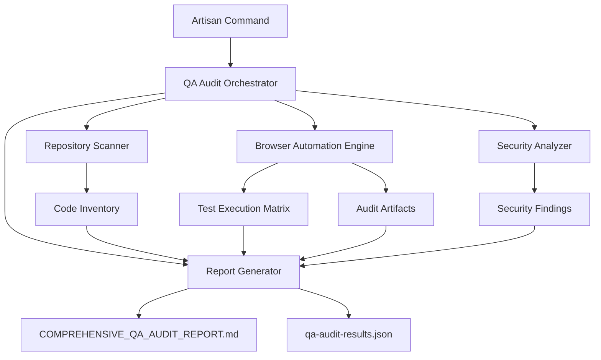

# Design Document: Enterprise QA Audit System

## Overview

The Enterprise QA Audit System is a comprehensive, autonomous quality assurance platform designed for the Synkk Laravel application. It performs multi-layered testing including repository analysis, end-to-end browser automation, security assessment, accessibility auditing, and performance profiling. The system generates actionable reports with prioritized recommendations and objective quality scoring.

This design follows a modular architecture where each major component (Repository Scanner, Browser Automation Engine, Security Analyzer, Report Generator) operates independently but coordinates through shared data structures. The system executes autonomously with minimal configuration, making it suitable for integration into CI/CD pipelines.

### Design Goals

1. **Autonomy**: Execute complete audit cycles without human intervention
2. **Comprehensiveness**: Cover functional, security, usability, accessibility, and performance dimensions
3. **Actionability**: Generate clear, prioritized recommendations with severity classifications
4. **Maintainability**: Use modern Laravel conventions and established testing frameworks
5. **Extensibility**: Support adding new test categories and audit rules
6. **CI/CD Integration**: Provide exit codes and machine-readable output for automation

## Architecture

### High-Level Component Architecture



### Component Responsibilities

1. **QA Audit Orchestrator** (`App\Services\QA\QAuditOrchestrator`)
   - Coordinates execution phases (repository scan → browser tests → security analysis → reporting)
   - Manages configuration loading and validation
   - Provides progress updates and error handling
   - Determines exit codes based on quality score thresholds

2. **Repository Scanner** (`App\Services\QA\RepositoryScanner`)
   - Analyzes Laravel project structure using filesystem traversal
   - Parses PHP files with Nikita Popov's PHP-Parser
   - Extracts routes, controllers, models, migrations, Livewire components
   - Detects architectural patterns and potential code issues
   - Generates structured inventory of application components

3. **Browser Automation Engine** (`App\Services\QA\BrowserAutomationEngine`)
   - Executes end-to-end tests using Pest 4 + Playwright
   - Manages test execution for multiple user roles
   - Captures screenshots, videos, console logs, network traffic
   - Measures performance metrics (FCP, LCP, TTI)
   - Tests responsive layouts across viewport sizes
   - Handles test failures gracefully with detailed error capture

4. **Security Analyzer** (`App\Services\QA\SecurityAnalyzer`)
   - Intercepts and analyzes network traffic during tests
   - Scans for PII leaks in logs, requests, responses, storage
   - Tests authentication and authorization mechanisms
   - Submits SQL injection and XSS test payloads
   - Validates security headers and CSRF protection
   - Classifies vulnerabilities by severity level

5. **Report Generator** (`App\Services\QA\ReportGenerator`)
   - Calculates weighted quality score from test results
   - Generates markdown report with executive summary
   - Creates prioritized action plan by severity
   - Embeds links to artifacts (screenshots, logs)
   - Exports machine-readable JSON for CI/CD integration
   - Provides production readiness assessment

### Data Flow

1. **Configuration Phase**: Load `qa-audit.config.json` or use defaults
2. **Repository Analysis Phase**: Scan codebase, extract endpoints, analyze patterns
3. **Test Execution Phase**: Run browser tests, capture artifacts, measure performance
4. **Security Analysis Phase**: Analyze network traffic, test injection vectors, detect leaks
5. **Report Generation Phase**: Aggregate results, calculate scores, generate reports
6. **Artifact Management Phase**: Organize files, create index, compress old artifacts

## Technology Stack

### Core Framework
- **Laravel 13**: Application framework (already installed per composer.json)
- **PHP 8.5**: Runtime environment (per composer.json)

### Browser Automation
- **Pest 5**: Testing framework (already installed per composer.json)
- **Playwright**: Browser automation via Pest browser testing
  - Chosen for: cross-browser support, auto-waiting, parallel execution, official Pest integration
  - Supports headless and headed modes
  - Native screenshot and video recording capabilities
  - Network interception for security analysis

### Code Analysis
- **nikic/php-parser**: AST parsing for PHP code analysis
- **symfony/finder**: Filesystem traversal and file discovery
- **Laravel's built-in Route reflection**: Route extraction

### Security Testing
- **Custom payload injection**: SQL injection, XSS, path traversal patterns
- **Network request interception**: Via Playwright's network API
- **Pattern matching**: Regex-based PII detection

### Accessibility Testing
- **axe-core**: Industry-standard accessibility rule engine (via Playwright)
- **WCAG 2.1 AA compliance checking**: Color contrast, ARIA, semantic HTML

### Performance Profiling
- **Playwright Performance APIs**: Web Vitals measurement (FCP, LCP, TTI)
- **Network timing**: Resource load analysis
- **Custom metrics**: Page load times, action response times

### Data Storage and Reporting
- **File-based artifacts**: Screenshots (PNG), videos (MP4), logs (JSON)
- **Markdown reports**: Human-readable comprehensive reports
- **JSON output**: Machine-readable results for CI/CD
- **SQLite (optional)**: Historical trend analysis database

## Components and Interfaces

### 1. QA Audit Orchestrator

**File**: `app/Services/QA/QAAuditOrchestrator.php`

**Interface**:
```php
interface QAAuditOrchestratorInterface
{
    public function runFullAudit(array $options = []): QAAuditResult;
    public function runPhase(string $phase, array $options = []): PhaseResult;
    public function getProgress(): ProgressStatus;
}
```

**Key Methods**:
- `runFullAudit()`: Execute all phases sequentially
- `runPhase(string $phase)`: Execute specific phase (repository, browser, security, report)
- `handleFailure(Exception $e, string $phase)`: Graceful error handling
- `emitProgress(string $message, float $percentage)`: Real-time progress updates

**Configuration Handling**:
```php
class QAAuditConfig
{
    public string $baseUrl = 'http://localhost:8000';
    public array $browsers = ['chromium'];
    public array $viewports = [320, 768, 1024, 1920];
    public array $enabledCategories = ['happy_path', 'edge_cases', 'security', 'usability', 'performance'];
    public int $pageLoadTimeout = 30000; // milliseconds
    public int $actionTimeout = 10000;
    public array $testUsers = [];
    public array $excludedTests = [];
    public bool $parallel = false;
    public bool $fast = false;
    public bool $videoRecording = true;
}
```

### 2. Repository Scanner

**File**: `app/Services/QA/RepositoryScanner.php`

**Interface**:
```php
interface RepositoryScannerInterface
{
    public function scanProject(): CodeInventory;
    public function extractRoutes(): RouteCollection;
    public function extractModels(): ModelCollection;
    public function extractLivewireComponents(): LivewireCollection;
    public function detectIssues(): IssueCollection;
}
```

**Key Classes**:
```php
class CodeInventory
{
    public RouteCollection $routes;
    public ModelCollection $models;
    public MigrationCollection $migrations;
    public LivewireCollection $livewireComponents;
    public IssueCollection $issues;
    public array $architecturePatterns;
}

class RouteDefinition
{
    public string $method; // GET, POST, PUT, DELETE
    public string $uri;
    public string $name;
    public string $controller;
    public string $action;
    public array $middleware;
    public bool $isApi;
}

class ModelDefinition
{
    public string $name;
    public string $table;
    public array $fillable;
    public array $casts;
    public array $relations;
}

class LivewireComponentDefinition
{
    public string $name;
    public string $class;
    public array $properties;
    public array $actions;
}

class CodeIssue
{
    public string $type; // sql_injection_risk, error_handling_gap, secret_exposure
    public string $severity; // Critical, High, Medium, Low
    public string $file;
    public int $line;
    public string $description;
    public string $recommendation;
}
```

**Detection Algorithms**:
1. **SQL Injection Risk Detection**
   - Parse query builder method chains
   - Detect raw SQL with string concatenation: `DB::raw("SELECT * FROM {$table}")`
   - Flag unparameterized `whereRaw()`, `selectRaw()` with variable interpolation

2. **Error Handling Gap Detection**
   - Find database operations (query builder, Eloquent) without surrounding try-catch
   - Check controller methods for missing exception handling
   - Identify network calls without error handling

3. **Secret Exposure Detection**
   - Scan for `Log::` statements containing regex patterns:
     - Email: `\b[A-Za-z0-9._%+-]+@[A-Za-z0-9.-]+\.[A-Z|a-z]{2,}\b`
     - Password variables: `\$password`, `'password' =>`
     - API keys: `sk_live_`, `pk_test_`, `Bearer [A-Za-z0-9]`
     - Tokens: `\$token`, `'token' =>`

### 3. Browser Automation Engine

**File**: `app/Services/QA/BrowserAutomationEngine.php`

**Interface**:
```php
interface BrowserAutomationEngineInterface
{
    public function runTestSuite(): TestMatrix;
    public function runTest(string $testName, array $options = []): TestResult;
    public function captureScreenshot(string $name): string; // returns path
    public function captureVideo(callable $actions): string; // returns path
    public function measurePerformance(string $url): PerformanceMetrics;
}
```

**Test Organization**:
```
tests/Browser/
├── HappyPath/
│   ├── UserRegistrationTest.php
│   ├── UserLoginTest.php
│   ├── DashboardNavigationTest.php
│   ├── VaultOperationsTest.php
│   ├── TeamManagementTest.php
│   ├── DevicePairingTest.php
│   └── UserLogoutTest.php
├── EdgeCases/
│   ├── RapidClickTest.php
│   ├── InvalidInputsTest.php
│   ├── BoundaryValuesTest.php
│   ├── MalformedRequestsTest.php
│   ├── NetworkLatencyTest.php
│   └── FileUploadEdgeCasesTest.php
├── Security/
│   ├── AuthenticationTest.php
│   ├── AuthorizationTest.php
│   ├── SessionManagementTest.php
│   ├── SQLInjectionTest.php
│   ├── XSSTest.php
│   └── CSRFTest.php
├── Usability/
│   ├── ResponsiveLayoutTest.php
│   ├── AccessibilityTest.php
│   ├── ColorContrastTest.php
│   └── InteractiveElementSizeTest.php
└── Performance/
    ├── PageLoadTest.php
    ├── APIResponseTimeTest.php
    └── WebVitalsTest.php
```

**Test Matrix Structure**:
```php
class TestMatrix
{
    public array $tests = []; // TestResult[]
    public TestStatistics $statistics;
}

class TestResult
{
    public string $name;
    public string $category; // happy_path, edge_case, security, usability, performance
    public string $status; // PASS, FAIL, SKIP
    public float $executionTime; // seconds
    public DateTime $timestamp;
    public ?string $errorMessage;
    public ?string $stackTrace;
    public array $artifacts = []; // paths to screenshots, logs, videos
}

class TestStatistics
{
    public int $totalTests;
    public int $passed;
    public int $failed;
    public int $skipped;
    public float $passRate;
    public float $totalExecutionTime;
}
```

**Browser Test Example (Happy Path)**:
```php
<?php

use function Pest\Laravel\{browse};

test('user can register successfully', function () {
    browse(function ($browser) {
        $browser
            ->visit('/register')
            ->screenshot('register-page')
            ->type('name', 'Test User')
            ->type('email', 'test@example.com')
            ->type('password', 'SecurePass123!')
            ->type('password_confirmation', 'SecurePass123!')
            ->press('Register')
            ->waitForRoute('dashboard')
            ->screenshot('dashboard-after-registration')
            ->assertSee('Welcome, Test User')
            ->assertPathIs('/dashboard');
    });
});
```

**Browser Test Example (Edge Case)**:
```php
test('form handles oversized input gracefully', function () {
    browse(function ($browser) {
        $oversizedString = str_repeat('A', 10001);
        
        $browser
            ->visit('/vault/create')
            ->type('name', $oversizedString)
            ->press('Create Vault')
            ->waitFor('.error-message')
            ->screenshot('oversized-input-error')
            ->assertSee('Name must not exceed 255 characters');
    });
});
```

**Browser Test Example (Security)**:
```php
test('XSS payloads are sanitized', function () {
    browse(function ($browser) {
        $xssPayload = '<script>alert("XSS")</script>';
        
        $browser
            ->loginAs(User::factory()->create())
            ->visit('/vault/create')
            ->type('name', $xssPayload)
            ->type('description', $xssPayload)
            ->press('Create Vault')
            ->waitForRoute('vaults.show')
            ->screenshot('xss-sanitized-output');
            
        // Verify payload is escaped in HTML
        $html = $browser->driver->getPageSource();
        expect($html)->not->toContain('<script>alert("XSS")</script>');
        expect($html)->toContain('&lt;script&gt;');
    });
});
```

**Performance Measurement**:
```php
class PerformanceMetrics
{
    public float $firstContentfulPaint; // milliseconds
    public float $largestContentfulPaint;
    public float $timeToInteractive;
    public float $pageLoadTime;
    public array $resourceTimings; // network requests
    
    public function isSlow(): bool
    {
        return $this->pageLoadTime > 5000 || $this->largestContentfulPaint > 2500;
    }
}

// Usage in test:
$metrics = $browser->performance()->getMetrics();
```

### 4. Security Analyzer

**File**: `app/Services/QA/SecurityAnalyzer.php`

**Interface**:
```php
interface SecurityAnalyzerInterface
{
    public function analyzeNetworkTraffic(array $requests): SecurityFindingCollection;
    public function detectPIILeaks(array $logs, array $storage): SecurityFindingCollection;
    public function testAuthenticationMechanisms(): SecurityFindingCollection;
    public function testAuthorizationControls(): SecurityFindingCollection;
    public function testInjectionVulnerabilities(): SecurityFindingCollection;
}
```

**Security Finding Structure**:
```php
class SecurityFinding
{
    public string $type; // pii_leak, sql_injection, xss, auth_bypass, etc.
    public string $severity; // Critical, High, Medium, Low
    public string $description;
    public string $location; // URL, file, or storage key
    public string $evidence; // actual data found
    public string $recommendation;
    public array $references; // CWE, OWASP links
}

class SecurityFindingCollection
{
    public array $findings = []; // SecurityFinding[]
    
    public function countBySeverity(): array;
    public function filterBySeverity(string $severity): self;
    public function toArray(): array;
}
```

**PII Detection Patterns**:
```php
class PIIDetector
{
    private const PATTERNS = [
        'email' => '/\b[A-Za-z0-9._%+-]+@[A-Za-z0-9.-]+\.[A-Z|a-z]{2,}\b/',
        'phone_us' => '/\b(\+1[-.\s]?)?\(?\d{3}\)?[-.\s]?\d{3}[-.\s]?\d{4}\b/',
        'ssn' => '/\b\d{3}-\d{2}-\d{4}\b/',
        'credit_card' => '/\b\d{4}[-\s]?\d{4}[-\s]?\d{4}[-\s]?\d{4}\b/',
        'api_key' => '/(sk_live_|pk_test_|api[_-]?key|bearer\s+)[A-Za-z0-9_-]+/i',
        'password' => '/(password|passwd|pwd)["\']?\s*[:=]\s*["\']?[^"\'\s,}]+/i',
    ];
    
    public function scan(string $content): array
    {
        $findings = [];
        foreach (self::PATTERNS as $type => $pattern) {
            if (preg_match_all($pattern, $content, $matches)) {
                foreach ($matches[0] as $match) {
                    $findings[] = [
                        'type' => $type,
                        'value' => $this->mask($match),
                        'position' => strpos($content, $match),
                    ];
                }
            }
        }
        return $findings;
    }
    
    private function mask(string $value): string
    {
        // Show first/last chars only: "test@example.com" -> "t***@e***.com"
        // Implementation details...
    }
}
```

**SQL Injection Test Payloads**:
```php
class SQLInjectionTester
{
    private const PAYLOADS = [
        "' OR '1'='1",
        "'; DROP TABLE users; --",
        "1' UNION SELECT * FROM users--",
        "admin'--",
        "' OR 1=1--",
        "1' AND SLEEP(5)--",
        "' UNION SELECT NULL, version(), NULL--",
    ];
    
    public function testEndpoint(string $url, array $formData): SecurityFinding
    {
        foreach (self::PAYLOADS as $payload) {
            // Submit payload to each form field
            // Check for: database errors, successful authentication, data leakage
            // Return finding if vulnerable
        }
    }
}
```

**XSS Test Payloads**:
```php
class XSSTester
{
    private const PAYLOADS = [
        '<script>alert("XSS")</script>',
        '',
        'javascript:alert("XSS")',
        '<svg onload=alert("XSS")>',
        '<iframe src="javascript:alert(\'XSS\')">',
        '<body onload=alert("XSS")>',
        '<input onfocus=alert("XSS") autofocus>',
    ];
    
    public function testEndpoint(string $url, array $formData): SecurityFinding
    {
        foreach (self::PAYLOADS as $payload) {
            // Submit payload
            // Check if payload executes or appears unescaped in HTML
            // Verify Content-Security-Policy headers
        }
    }
}
```

### 5. Report Generator

**File**: `app/Services/QA/ReportGenerator.php`

**Interface**:
```php
interface ReportGeneratorInterface
{
    public function generateReport(QAAuditResult $auditResult): Report;
    public function calculateQualityScore(QAAuditResult $auditResult): QualityScore;
    public function exportMarkdown(Report $report, string $path): void;
    public function exportJSON(Report $report, string $path): void;
}
```

**Quality Score Calculation**:
```php
class QualityScoreCalculator
{
    public function calculate(TestMatrix $testMatrix, SecurityFindingCollection $findings, array $performanceMetrics, array $usabilityIssues): QualityScore
    {
        // Pass Rate Component (40% weight)
        $passRate = ($testMatrix->statistics->passed / $testMatrix->statistics->totalTests) * 100;
        
        // Security Score Component (30% weight)
        $criticalIssues = $findings->filterBySeverity('Critical')->count();
        $highIssues = $findings->filterBySeverity('High')->count();
        $mediumIssues = $findings->filterBySeverity('Medium')->count();
        $lowIssues = $findings->filterBySeverity('Low')->count();
        
        $securityScore = max(0, 100 - ($criticalIssues * 20) - ($highIssues * 10) - ($mediumIssues * 5) - ($lowIssues * 2));
        
        // Performance Score Component (20% weight)
        $slowPages = collect($performanceMetrics)->filter(fn($m) => $m->pageLoadTime > 5000)->count();
        $performanceScore = max(0, 100 - ($slowPages * 10));
        
        // Usability Score Component (10% weight)
        $layoutIssues = collect($usabilityIssues)->where('type', 'layout')->count();
        $contrastIssues = collect($usabilityIssues)->where('type', 'contrast')->count();
        $accessibilityIssues = collect($usabilityIssues)->where('type', 'accessibility')->count();
        
        $usabilityScore = max(0, 100 - ($layoutIssues * 5) - ($contrastIssues * 3) - ($accessibilityIssues * 4));
        
        // Weighted Total
        $totalScore = ($passRate * 0.4) + ($securityScore * 0.3) + ($performanceScore * 0.2) + ($usabilityScore * 0.1);
        
        return new QualityScore(
            total: round($totalScore),
            passRate: $passRate,
            securityScore: $securityScore,
            performanceScore: $performanceScore,
            usabilityScore: $usabilityScore,
        );
    }
}

class QualityScore
{
    public function __construct(
        public int $total,
        public float $passRate,
        public float $securityScore,
        public float $performanceScore,
        public float $usabilityScore,
    ) {}
    
    public function getReadinessAssessment(): string
    {
        return match(true) {
            $this->total >= 90 => 'Ready',
            $this->total >= 70 => 'Conditional',
            default => 'Not Ready',
        };
    }
    
    public function getColorCode(): string
    {
        return match(true) {
            $this->total >= 90 => 'green',
            $this->total >= 70 => 'yellow',
            default => 'red',
        };
    }
}
```

**Report Structure**:
```php
class Report
{
    public function __construct(
        public QualityScore $qualityScore,
        public TestMatrix $testMatrix,
        public CodeInventory $codeInventory,
        public SecurityFindingCollection $securityFindings,
        public array $performanceMetrics,
        public array $usabilityIssues,
        public ActionPlan $actionPlan,
        public array $artifactPaths,
    ) {}
}

class ActionPlan
{
    public array $items = []; // ActionItem[]
    
    public function prioritize(): void
    {
        // Sort by severity (Critical > High > Medium > Low)
        // Then by effort (Low > Medium > High)
    }
}

class ActionItem
{
    public function __construct(
        public string $severity,
        public string $title,
        public string $description,
        public string $recommendedFix,
        public string $effort, // Low, Medium, High
        public array $references, // links to docs, CWE, OWASP
    ) {}
}
```

**Markdown Report Template**:
```markdown
# COMPREHENSIVE QA AUDIT REPORT

**Generated**: {timestamp}
**Application**: Synkk Enterprise Obsidian Vault Sync
**Audit Duration**: {duration}

---

## Executive Summary

### Quality Score: {score}/100 ({color})

**Production Readiness**: {Ready|Conditional|Not Ready}

- **Total Tests**: {total}
- **Pass Rate**: {passRate}%
- **Critical Issues**: {criticalCount}
- **High Issues**: {highCount}

### Score Breakdown

| Component | Score | Weight |
|-----------|-------|--------|
| Test Pass Rate | {passRate}/100 | 40% |
| Security | {securityScore}/100 | 30% |
| Performance | {performanceScore}/100 | 20% |
| Usability | {usabilityScore}/100 | 10% |

---

## Test Execution Matrix

| Test Name | Category | Status | Time | Notes |
|-----------|----------|--------|------|-------|
| User Registration | Happy Path | ✅ PASS | 2.3s | - |
| SQL Injection Test | Security | ❌ FAIL | 1.1s | Vulnerable endpoint detected |
| ... | ... | ... | ... | ... |

---

## Logic and UX Analysis

### Architecture Patterns Detected
- {pattern1}
- {pattern2}

### Code Quality Observations
- {observation1}
- {observation2}

### Usability Concerns
- {concern1}
- {concern2}

---

## Security Vulnerabilities

| Severity | Issue | Location | Evidence | Fix |
|----------|-------|----------|----------|-----|
| Critical | SQL Injection | /api/search | [Screenshot](path) | Use parameterized queries |
| ... | ... | ... | ... | ... |

---

## Performance Analysis

### Slow Pages
| Page | Load Time | LCP | Recommendation |
|------|-----------|-----|----------------|
| /dashboard | 6.2s | 3.1s | Implement lazy loading |
| ... | ... | ... | ... |

### Slow API Endpoints
| Endpoint | Response Time | Recommendation |
|----------|---------------|----------------|
| POST /api/vault/sync | 1.8s | Add database indexes |
| ... | ... | ... |

---

## Accessibility Issues

| Severity | Issue | Location | WCAG | Fix |
|----------|-------|----------|------|-----|
| High | Missing alt text | /vaults/show | 1.1.1 | Add descriptive alt attributes |
| ... | ... | ... | ... | ... |

---

## Action Plan

### Critical Priority (Must Fix Before Production)
1. **Fix SQL Injection vulnerability in search endpoint**
   - Effort: Medium
   - Use Laravel's query builder with parameter binding
   - Reference: [OWASP SQL Injection](link)

### High Priority (Should Fix Before Production)
2. **Add XSS sanitization for user-generated content**
   - Effort: Low
   - Use Laravel's `e()` helper or `{{ }}` Blade syntax
   - Reference: [OWASP XSS](link)

### Medium Priority (Fix Soon)
...

### Low Priority (Nice to Have)
...

---

## Artifacts

- [Screenshots Directory](qa-audit-artifacts/{timestamp}/screenshots/)
- [Video Recordings](qa-audit-artifacts/{timestamp}/videos/)
- [Console Logs](qa-audit-artifacts/{timestamp}/logs/)
- [Network Logs](qa-audit-artifacts/{timestamp}/network/)
- [Artifact Index](qa-audit-artifacts/{timestamp}/index.html)

---

## Recommendations for Next Audit

1. Implement fixes from Critical and High priority sections
2. Add integration tests for authentication flows
3. Set up automated security scanning in CI/CD
4. Implement performance monitoring
```

## Data Models

### Configuration Schema

**File**: `qa-audit.config.json`

```json
{
  "$schema": "https://json-schema.org/draft/2020-12/schema",
  "type": "object",
  "properties": {
    "baseUrl": {
      "type": "string",
      "default": "http://localhost:8000",
      "description": "Base URL of the application under test"
    },
    "browsers": {
      "type": "array",
      "items": {
        "type": "string",
        "enum": ["chromium", "firefox", "webkit"]
      },
      "default": ["chromium"]
    },
    "viewports": {
      "type": "array",
      "items": { "type": "integer" },
      "default": [320, 768, 1024, 1920]
    },
    "enabledCategories": {
      "type": "array",
      "items": {
        "type": "string",
        "enum": ["happy_path", "edge_cases", "security", "usability", "performance"]
      },
      "default": ["happy_path", "edge_cases", "security", "usability", "performance"]
    },
    "timeouts": {
      "type": "object",
      "properties": {
        "pageLoad": { "type": "integer", "default": 30000 },
        "action": { "type": "integer", "default": 10000 }
      }
    },
    "testUsers": {
      "type": "array",
      "items": {
        "type": "object",
        "properties": {
          "role": { "type": "string" },
          "email": { "type": "string" },
          "password": { "type": "string" }
        },
        "required": ["role", "email", "password"]
      }
    },
    "excludedTests": {
      "type": "array",
      "items": { "type": "string" }
    },
    "parallel": {
      "type": "boolean",
      "default": false
    },
    "fast": {
      "type": "boolean",
      "default": false
    },
    "videoRecording": {
      "type": "boolean",
      "default": true
    }
  }
}
```

**Example Configuration**:
```json
{
  "baseUrl": "http://localhost:8000",
  "browsers": ["chromium"],
  "viewports": [320, 768, 1024, 1920],
  "enabledCategories": ["happy_path", "security", "performance"],
  "timeouts": {
    "pageLoad": 30000,
    "action": 10000
  },
  "testUsers": [
    {
      "role": "super_admin",
      "email": "admin@test.local",
      "password": "SecureAdminPass123!"
    },
    {
      "role": "standard_user",
      "email": "user@test.local",
      "password": "SecureUserPass123!"
    }
  ],
  "excludedTests": ["PerformanceTest::testUnderLoad"],
  "parallel": false,
  "fast": false,
  "videoRecording": true
}
```

### Test Results Schema

**File**: `qa-audit-results.json`

```json
{
  "$schema": "https://json-schema.org/draft/2020-12/schema",
  "type": "object",
  "properties": {
    "timestamp": { "type": "string", "format": "date-time" },
    "duration": { "type": "number" },
    "qualityScore": {
      "type": "object",
      "properties": {
        "total": { "type": "integer", "minimum": 0, "maximum": 100 },
        "passRate": { "type": "number" },
        "securityScore": { "type": "number" },
        "performanceScore": { "type": "number" },
        "usabilityScore": { "type": "number" },
        "readinessAssessment": {
          "type": "string",
          "enum": ["Ready", "Conditional", "Not Ready"]
        }
      }
    },
    "testMatrix": {
      "type": "object",
      "properties": {
        "statistics": {
          "type": "object",
          "properties": {
            "totalTests": { "type": "integer" },
            "passed": { "type": "integer" },
            "failed": { "type": "integer" },
            "skipped": { "type": "integer" },
            "passRate": { "type": "number" },
            "totalExecutionTime": { "type": "number" }
          }
        },
        "tests": {
          "type": "array",
          "items": {
            "type": "object",
            "properties": {
              "name": { "type": "string" },
              "category": { "type": "string" },
              "status": { "type": "string", "enum": ["PASS", "FAIL", "SKIP"] },
              "executionTime": { "type": "number" },
              "timestamp": { "type": "string", "format": "date-time" },
              "errorMessage": { "type": "string" },
              "artifacts": { "type": "array", "items": { "type": "string" } }
            }
          }
        }
      }
    },
    "securityFindings": {
      "type": "array",
      "items": {
        "type": "object",
        "properties": {
          "type": { "type": "string" },
          "severity": { "type": "string", "enum": ["Critical", "High", "Medium", "Low"] },
          "description": { "type": "string" },
          "location": { "type": "string" },
          "evidence": { "type": "string" },
          "recommendation": { "type": "string" }
        }
      }
    },
    "performanceMetrics": { "type": "object" },
    "usabilityIssues": { "type": "array" },
    "actionPlan": {
      "type": "array",
      "items": {
        "type": "object",
        "properties": {
          "severity": { "type": "string" },
          "title": { "type": "string" },
          "description": { "type": "string" },
          "recommendedFix": { "type": "string" },
          "effort": { "type": "string", "enum": ["Low", "Medium", "High"] }
        }
      }
    }
  }
}
```

## Algorithm Designs

### 1. Quality Score Calculation Algorithm

**Purpose**: Calculate objective production readiness score from test results

**Inputs**:
- Test Matrix (pass/fail counts)
- Security Findings (by severity)
- Performance Metrics (page load times)
- Usability Issues (by type)

**Algorithm**:
```
FUNCTION calculateQualityScore(testMatrix, securityFindings, performanceMetrics, usabilityIssues):
    // Component 1: Test Pass Rate (40% weight)
    passRate = (testMatrix.passed / testMatrix.totalTests) * 100
    
    // Component 2: Security Score (30% weight)
    criticalIssues = COUNT(securityFindings WHERE severity = "Critical")
    highIssues = COUNT(securityFindings WHERE severity = "High")
    mediumIssues = COUNT(securityFindings WHERE severity = "Medium")
    lowIssues = COUNT(securityFindings WHERE severity = "Low")
    
    securityScore = MAX(0, 100 - (criticalIssues * 20) - (highIssues * 10) - (mediumIssues * 5) - (lowIssues * 2))
    
    // Component 3: Performance Score (20% weight)
    slowPages = COUNT(performanceMetrics WHERE pageLoadTime > 5000)
    performanceScore = MAX(0, 100 - (slowPages * 10))
    
    // Component 4: Usability Score (10% weight)
    layoutIssues = COUNT(usabilityIssues WHERE type = "layout")
    contrastIssues = COUNT(usabilityIssues WHERE type = "contrast")
    accessibilityIssues = COUNT(usabilityIssues WHERE type = "accessibility")
    
    usabilityScore = MAX(0, 100 - (layoutIssues * 5) - (contrastIssues * 3) - (accessibilityIssues * 4))
    
    // Weighted Total
    totalScore = (passRate * 0.4) + (securityScore * 0.3) + (performanceScore * 0.2) + (usabilityScore * 0.1)
    
    RETURN ROUND(totalScore)
```

**Output**: Integer score 0-100

**Production Readiness Mapping**:
- Score >= 90: "Ready" (green)
- Score 70-89: "Conditional" (yellow) - minor fixes required
- Score < 70: "Not Ready" (red) - blocking issues present

### 2. Security Scanning Algorithm

**Purpose**: Detect vulnerabilities, PII leaks, and credential exposures

**Inputs**:
- Network traffic logs (requests/responses)
- Browser console logs
- Browser storage (LocalStorage, SessionStorage, Cookies)
- Form submission data

**Algorithm**:
```
FUNCTION scanForSecurityIssues(networkLogs, consoleLogs, browserStorage):
    findings = []
    
    // Scan network traffic
    FOR EACH request IN networkLogs:
        // Check for PII in request body
        piiMatches = detectPII(request.body)
        FOR EACH match IN piiMatches:
            IF match.type NOT IN ["email"] OR match.context != "authentication":
                findings.ADD(createFinding(
                    type: "pii_leak_request",
                    severity: "High",
                    location: request.url,
                    evidence: mask(match.value)
                ))
        
        // Check for exposed credentials
        credentialMatches = detectCredentials(request.body)
        FOR EACH match IN credentialMatches:
            findings.ADD(createFinding(
                type: "credential_exposure",
                severity: "Critical",
                location: request.url,
                evidence: mask(match.value)
            ))
    
    FOR EACH response IN networkLogs:
        // Check for PII in response body
        piiMatches = detectPII(response.body)
        FOR EACH match IN piiMatches:
            findings.ADD(createFinding(
                type: "pii_leak_response",
                severity: "High",
                location: response.url,
                evidence: mask(match.value)
            ))
    
    // Scan console logs
    FOR EACH log IN consoleLogs:
        piiMatches = detectPII(log.message)
        FOR EACH match IN piiMatches:
            findings.ADD(createFinding(
                type: "pii_leak_console",
                severity: "Medium",
                location: "Console",
                evidence: mask(match.value)
            ))
    
    // Scan browser storage
    FOR EACH key, value IN browserStorage:
        IF containsSensitiveData(value):
            findings.ADD(createFinding(
                type: "sensitive_data_storage",
                severity: "High",
                location: "Browser Storage: " + key,
                evidence: mask(value)
            ))
    
    RETURN findings

FUNCTION detectPII(content):
    patterns = {
        "email": /\b[A-Za-z0-9._%+-]+@[A-Za-z0-9.-]+\.[A-Z|a-z]{2,}\b/,
        "phone": /\b\d{3}-\d{3}-\d{4}\b/,
        "ssn": /\b\d{3}-\d{2}-\d{4}\b/,
        "credit_card": /\b\d{4}-\d{4}-\d{4}-\d{4}\b/
    }
    
    matches = []
    FOR EACH type, pattern IN patterns:
        IF content MATCHES pattern:
            matches.ADD({type: type, value: matched_string})
    
    RETURN matches

FUNCTION detectCredentials(content):
    patterns = {
        "api_key": /(sk_live_|pk_test_|api[_-]?key)[A-Za-z0-9_-]+/i,
        "password": /password["\']?\s*[:=]\s*["\']?[^"'\s,}]+/i,
        "token": /bearer\s+[A-Za-z0-9_-]+/i
    }
    // Similar matching logic...
```

### 3. Performance Profiling Algorithm

**Purpose**: Measure page performance and identify bottlenecks

**Inputs**:
- Browser navigation events
- Resource timing API data
- Web Vitals metrics

**Algorithm**:
```
FUNCTION profilePerformance(page):
    metrics = {}
    
    // Measure Core Web Vitals
    metrics.fcp = MEASURE_FIRST_CONTENTFUL_PAINT(page)
    metrics.lcp = MEASURE_LARGEST_CONTENTFUL_PAINT(page)
    metrics.tti = MEASURE_TIME_TO_INTERACTIVE(page)
    metrics.cls = MEASURE_CUMULATIVE_LAYOUT_SHIFT(page)
    
    // Measure page load time
    startTime = NAVIGATION_START_TIME(page)
    endTime = LOAD_COMPLETE_TIME(page)
    metrics.pageLoadTime = endTime - startTime
    
    // Analyze resource timings
    resources = GET_RESOURCE_TIMING_ENTRIES(page)
    metrics.resourceTimings = []
    
    FOR EACH resource IN resources:
        timing = {
            name: resource.name,
            type: resource.initiatorType,
            duration: resource.duration,
            size: resource.transferSize,
            startTime: resource.startTime
        }
        metrics.resourceTimings.ADD(timing)
    
    // Identify slow resources
    slowResources = FILTER(metrics.resourceTimings WHERE duration > 1000)
    metrics.slowResources = slowResources
    
    // Calculate score
    metrics.score = calculatePerformanceScore(metrics)
    
    RETURN metrics

FUNCTION calculatePerformanceScore(metrics):
    score = 100
    
    // Penalize slow FCP (should be < 1.8s)
    IF metrics.fcp > 1800:
        score -= MIN(20, (metrics.fcp - 1800) / 100)
    
    // Penalize slow LCP (should be < 2.5s)
    IF metrics.lcp > 2500:
        score -= MIN(30, (metrics.lcp - 2500) / 100)
    
    // Penalize slow TTI (should be < 3.8s)
    IF metrics.tti > 3800:
        score -= MIN(20, (metrics.tti - 3800) / 100)
    
    // Penalize high CLS (should be < 0.1)
    IF metrics.cls > 0.1:
        score -= (metrics.cls - 0.1) * 100
    
    RETURN MAX(0, score)
```

### 4. Accessibility Audit Algorithm

**Purpose**: Detect WCAG violations and accessibility issues

**Inputs**:
- DOM snapshot
- Element attributes and computed styles
- Keyboard navigation state

**Algorithm**:
```
FUNCTION auditAccessibility(page):
    violations = []
    
    // Check images for alt text
    images = SELECT_ALL(page, "img")
    FOR EACH img IN images:
        IF NOT img.hasAttribute("alt") OR img.getAttribute("alt") == "":
            violations.ADD({
                rule: "WCAG 1.1.1",
                severity: "High",
                element: img,
                issue: "Image missing alt attribute",
                fix: "Add descriptive alt text"
            })
    
    // Check form inputs for labels
    inputs = SELECT_ALL(page, "input, select, textarea")
    FOR EACH input IN inputs:
        IF input.type NOT IN ["hidden", "submit", "button"]:
            hasLabel = HAS_ASSOCIATED_LABEL(input) OR input.hasAttribute("aria-label")
            IF NOT hasLabel:
                violations.ADD({
                    rule: "WCAG 1.3.1",
                    severity: "High",
                    element: input,
                    issue: "Form input missing label",
                    fix: "Add <label> or aria-label"
                })
    
    // Check color contrast
    textElements = SELECT_ALL(page, "p, h1, h2, h3, h4, h5, h6, a, button, span")
    FOR EACH element IN textElements:
        foreground = GET_COMPUTED_COLOR(element, "color")
        background = GET_COMPUTED_COLOR(element, "background-color")
        contrast = CALCULATE_CONTRAST_RATIO(foreground, background)
        
        fontSize = GET_COMPUTED_SIZE(element, "font-size")
        isLargeText = fontSize >= 18 OR (fontSize >= 14 AND FONT_WEIGHT >= 700)
        
        minimumRatio = IF isLargeText THEN 3.0 ELSE 4.5
        
        IF contrast < minimumRatio:
            violations.ADD({
                rule: "WCAG 1.4.3",
                severity: "Medium",
                element: element,
                issue: "Insufficient color contrast: " + contrast.toFixed(2) + ":1",
                fix: "Increase contrast to at least " + minimumRatio + ":1"
            })
    
    // Check heading hierarchy
    headings = SELECT_ALL(page, "h1, h2, h3, h4, h5, h6")
    previousLevel = 0
    FOR EACH heading IN headings:
        level = PARSE_INT(heading.tagName.substring(1))
        IF level > previousLevel + 1:
            violations.ADD({
                rule: "WCAG 1.3.1",
                severity: "Medium",
                element: heading,
                issue: "Heading hierarchy skips level",
                fix: "Use sequential heading levels"
            })
        previousLevel = level
    
    // Check keyboard accessibility
    interactiveElements = SELECT_ALL(page, "a, button, input, select, textarea")
    FOR EACH element IN interactiveElements:
        IF element.tabIndex < 0:
            violations.ADD({
                rule: "WCAG 2.1.1",
                severity: "High",
                element: element,
                issue: "Interactive element not keyboard accessible",
                fix: "Remove negative tabindex or ensure proper focus management"
            })
    
    RETURN violations

FUNCTION CALCULATE_CONTRAST_RATIO(foreground, background):
    // Convert RGB to relative luminance
    L1 = RELATIVE_LUMINANCE(foreground)
    L2 = RELATIVE_LUMINANCE(background)
    
    // Calculate contrast ratio
    lighter = MAX(L1, L2)
    darker = MIN(L1, L2)
    
    RETURN (lighter + 0.05) / (darker + 0.05)
```

## Integration Points with Laravel Application

### 1. Artisan Command Interface

**File**: `app/Console/Commands/RunQAAuditCommand.php`

```php
<?php

namespace App\Console\Commands;

use App\Services\QA\QAAuditOrchestrator;
use Illuminate\Console\Command;

class RunQAAuditCommand extends Command
{
    protected $signature = 'qa:audit
                            {--parallel : Run tests in parallel}
                            {--fast : Skip slow visual regression tests}
                            {--category=* : Test categories to run}
                            {--config= : Path to custom config file}';
    
    protected $description = 'Run comprehensive QA audit system';
    
    public function handle(QAAuditOrchestrator $orchestrator): int
    {
        $this->info('Starting QA Audit System...');
        
        $options = [
            'parallel' => $this->option('parallel'),
            'fast' => $this->option('fast'),
            'categories' => $this->option('category'),
            'config' => $this->option('config'),
        ];
        
        $result = $orchestrator->runFullAudit($options);
        
        $this->newLine();
        $this->info("Audit completed in {$result->duration}s");
        $this->info("Quality Score: {$result->qualityScore->total}/100");
        
        $color = $result->qualityScore->getColorCode();
        $this->{$color === 'green' ? 'info' : ($color === 'yellow' ? 'warn' : 'error')}(
            "Production Readiness: {$result->qualityScore->getReadinessAssessment()}"
        );
        
        $this->newLine();
        $this->info("Report generated: COMPREHENSIVE_QA_AUDIT_REPORT.md");
        
        // Exit code: 0 if score >= 70, 1 otherwise (for CI/CD)
        return $result->qualityScore->total >= 70 ? 0 : 1;
    }
}
```

**Usage Examples**:
```bash
# Run full audit
php artisan qa:audit

# Run with parallel execution
php artisan qa:audit --parallel

# Run fast mode (skip slow tests)
php artisan qa:audit --fast

# Run specific categories only
php artisan qa:audit --category=security --category=performance

# Use custom config
php artisan qa:audit --config=/path/to/custom-config.json
```

### 2. Service Provider Registration

**File**: `app/Providers/QAAuditServiceProvider.php`

```php
<?php

namespace App\Providers;

use App\Services\QA\BrowserAutomationEngine;
use App\Services\QA\QAAuditOrchestrator;
use App\Services\QA\RepositoryScanner;
use App\Services\QA\ReportGenerator;
use App\Services\QA\SecurityAnalyzer;
use Illuminate\Support\ServiceProvider;

class QAAuditServiceProvider extends ServiceProvider
{
    public function register(): void
    {
        $this->app->singleton(QAAuditOrchestrator::class);
        $this->app->singleton(RepositoryScanner::class);
        $this->app->singleton(BrowserAutomationEngine::class);
        $this->app->singleton(SecurityAnalyzer::class);
        $this->app->singleton(ReportGenerator::class);
    }
    
    public function boot(): void
    {
        if ($this->app->runningInConsole()) {
            $this->commands([
                \App\Console\Commands\RunQAAuditCommand::class,
            ]);
        }
    }
}
```

Register in `bootstrap/providers.php`:
```php
return [
    // ... existing providers
    App\Providers\QAAuditServiceProvider::class,
];
```

### 3. Database Integration (Optional Historical Tracking)

**Migration**: `database/migrations/xxxx_create_qa_audit_runs_table.php`

```php
<?php

use Illuminate\Database\Migrations\Migration;
use Illuminate\Database\Schema\Blueprint;
use Illuminate\Support\Facades\Schema;

return new class extends Migration
{
    public function up(): void
    {
        Schema::create('qa_audit_runs', function (Blueprint $table) {
            $table->id();
            $table->integer('quality_score');
            $table->float('pass_rate');
            $table->integer('total_tests');
            $table->integer('passed_tests');
            $table->integer('failed_tests');
            $table->integer('critical_issues');
            $table->integer('high_issues');
            $table->integer('medium_issues');
            $table->integer('low_issues');
            $table->float('duration_seconds');
            $table->json('results'); // full results object
            $table->string('report_path');
            $table->timestamps();
        });
    }
    
    public function down(): void
    {
        Schema::dropIfExists('qa_audit_runs');
    }
};
```

### 4. Test Database Configuration

**File**: `.env.testing`

```env
APP_ENV=testing
APP_DEBUG=true
APP_URL=http://localhost:8000

DB_CONNECTION=sqlite
DB_DATABASE=:memory:

CACHE_STORE=array
QUEUE_CONNECTION=sync
SESSION_DRIVER=array

MAIL_MAILER=array
```

### 5. Pest Configuration for Browser Testing

**File**: `tests/Pest.php`

```php
<?php

use Tests\TestCase;

uses(TestCase::class)->in('Feature', 'Unit');

// Browser test configuration
uses()
    ->beforeEach(function () {
        // Start application server if not running
        // Configure Playwright browser options
    })
    ->afterEach(function () {
        // Cleanup test data
        // Close browser instances
    })
    ->in('Browser');
```

**File**: `phpunit.xml` (add browser test suite)

```xml
<testsuites>
    <testsuite name="Unit">
        <directory>tests/Unit</directory>
    </testsuite>
    <testsuite name="Feature">
        <directory>tests/Feature</directory>
    </testsuite>
    <testsuite name="Browser">
        <directory>tests/Browser</directory>
    </testsuite>
</testsuites>
```

## File Structure and Organization

```
synkk/
├── app/
│   ├── Console/
│   │   └── Commands/
│   │       └── RunQAAuditCommand.php
│   ├── Providers/
│   │   └── QAAuditServiceProvider.php
│   └── Services/
│       └── QA/
│           ├── QAAuditOrchestrator.php
│           ├── RepositoryScanner.php
│           ├── BrowserAutomationEngine.php
│           ├── SecurityAnalyzer.php
│           ├── ReportGenerator.php
│           ├── DTOs/
│           │   ├── QAAuditResult.php
│           │   ├── CodeInventory.php
│           │   ├── TestMatrix.php
│           │   ├── SecurityFinding.php
│           │   ├── PerformanceMetrics.php
│           │   ├── QualityScore.php
│           │   └── Report.php
│           ├── Detectors/
│           │   ├── PIIDetector.php
│           │   ├── SQLInjectionDetector.php
│           │   ├── XSSDetector.php
│           │   └── CodeIssueDetector.php
│           ├── Analyzers/
│           │   ├── RouteAnalyzer.php
│           │   ├── ModelAnalyzer.php
│           │   ├── MigrationAnalyzer.php
│           │   └── LivewireAnalyzer.php
│           └── Calculators/
│               ├── QualityScoreCalculator.php
│               └── PerformanceScoreCalculator.php
├── tests/
│   ├── Browser/
│   │   ├── HappyPath/
│   │   │   ├── UserRegistrationTest.php
│   │   │   ├── UserLoginTest.php
│   │   │   ├── DashboardNavigationTest.php
│   │   │   ├── VaultOperationsTest.php
│   │   │   ├── TeamManagementTest.php
│   │   │   ├── DevicePairingTest.php
│   │   │   └── UserLogoutTest.php
│   │   ├── EdgeCases/
│   │   │   ├── RapidClickTest.php
│   │   │   ├── InvalidInputsTest.php
│   │   │   ├── BoundaryValuesTest.php
│   │   │   ├── MalformedRequestsTest.php
│   │   │   ├── NetworkLatencyTest.php
│   │   │   └── FileUploadEdgeCasesTest.php
│   │   ├── Security/
│   │   │   ├── AuthenticationTest.php
│   │   │   ├── AuthorizationTest.php
│   │   │   ├── SessionManagementTest.php
│   │   │   ├── SQLInjectionTest.php
│   │   │   ├── XSSTest.php
│   │   │   └── CSRFTest.php
│   │   ├── Usability/
│   │   │   ├── ResponsiveLayoutTest.php
│   │   │   ├── AccessibilityTest.php
│   │   │   ├── ColorContrastTest.php
│   │   │   └── InteractiveElementSizeTest.php
│   │   └── Performance/
│   │       ├── PageLoadTest.php
│   │       ├── APIResponseTimeTest.php
│   │       └── WebVitalsTest.php
│   ├── Unit/
│   │   └── Services/
│   │       └── QA/
│   │           ├── QualityScoreCalculatorTest.php
│   │           ├── PIIDetectorTest.php
│   │           ├── SQLInjectionDetectorTest.php
│   │           └── XSSDetectorTest.php
│   └── Feature/
│       └── Commands/
│           └── RunQAAuditCommandTest.php
├── database/
│   └── migrations/
│       └── xxxx_create_qa_audit_runs_table.php (optional)
├── config/
│   └── qa-audit.php (optional config publishing)
├── qa-audit-artifacts/ (generated at runtime)
│   └── {timestamp}/
│       ├── screenshots/
│       ├── videos/
│       ├── logs/
│       ├── network/
│       └── index.html
├── qa-audit.config.json (user-customizable)
├── COMPREHENSIVE_QA_AUDIT_REPORT.md (generated)
└── qa-audit-results.json (generated)
```

### File Organization Principles

1. **Service Layer**: All QA logic in `app/Services/QA/` following Laravel conventions
2. **DTOs**: Data Transfer Objects for type-safe data structures
3. **Detectors**: Specialized detection algorithms (PII, SQL injection, XSS)
4. **Analyzers**: Code analysis components (routes, models, migrations)
5. **Calculators**: Score calculation and metric aggregation
6. **Browser Tests**: Organized by category in `tests/Browser/`
7. **Artifacts**: Generated files in `qa-audit-artifacts/` with timestamped directories
8. **Configuration**: JSON config in project root for easy customization

## Error Handling

### Exception Hierarchy

```php
namespace App\Services\QA\Exceptions;

class QAAuditException extends Exception {}

class ConfigurationException extends QAAuditException {}
class RepositoryScanException extends QAAuditException {}
class BrowserAutomationException extends QAAuditException {}
class SecurityAnalysisException extends QAAuditException {}
class ReportGenerationException extends QAAuditException {}
```

### Error Handling Strategy

1. **Graceful Degradation**: If one test fails, continue with remaining tests
2. **Detailed Logging**: Log all errors with context (phase, test name, stack trace)
3. **Artifact Capture**: On failure, capture screenshot, HTML, console logs, network logs
4. **Partial Results**: Generate report even if some phases fail
5. **User Feedback**: Provide clear error messages with remediation steps

### Example Error Handling

```php
public function runFullAudit(array $options = []): QAAuditResult
{
    $phaseResults = [];
    
    try {
        $phaseResults['repository'] = $this->runRepositoryScanner();
    } catch (RepositoryScanException $e) {
        Log::error('Repository scan failed', ['exception' => $e]);
        $phaseResults['repository'] = PhaseResult::failed($e->getMessage());
    }
    
    try {
        $phaseResults['browser'] = $this->runBrowserTests();
    } catch (BrowserAutomationException $e) {
        Log::error('Browser tests failed', ['exception' => $e]);
        $phaseResults['browser'] = PhaseResult::failed($e->getMessage());
    }
    
    // Continue with security and report phases even if earlier phases failed
    
    return new QAAuditResult($phaseResults);
}
```

## Testing Strategy

### Unit Testing
- Test individual detectors (PII, SQL injection, XSS) with known payloads
- Test quality score calculator with various input combinations
- Test configuration parser with valid/invalid configs
- Test data structures and DTOs

**Example Unit Test**:
```php
test('PII detector finds email addresses', function () {
    $detector = new PIIDetector();
    $content = 'Contact us at support@example.com for help';
    
    $findings = $detector->scan($content);
    
    expect($findings)->toHaveCount(1);
    expect($findings[0]['type'])->toBe('email');
    expect($findings[0]['value'])->toContain('@');
});
```

### Integration Testing
- Test orchestrator coordination of components
- Test report generation with sample data
- Test artifact organization and file creation
- Test database tracking (if enabled)

**Example Integration Test**:
```php
test('orchestrator runs all phases sequentially', function () {
    $orchestrator = new QAAuditOrchestrator();
    $result = $orchestrator->runFullAudit(['fast' => true]);
    
    expect($result->phaseResults)->toHaveKeys(['repository', 'browser', 'security', 'report']);
    expect($result->qualityScore)->toBeInstanceOf(QualityScore::class);
});
```

### Browser Testing
- Test each user flow category (happy path, edge cases, security)
- Use Pest + Playwright for real browser automation
- Capture artifacts on failure for debugging
- Validate assertions match requirements

**Browser tests are the primary tests that validate all 20 requirements.**

### Property-Based Testing

**Not applicable for this system.** The QA Audit System is primarily:
- Infrastructure automation (browser testing framework)
- Side-effect operations (screenshot capture, file generation, network monitoring)
- External system testing (testing the Laravel application, not pure functions)
- Configuration validation (schema checking)

Alternative testing approaches used:
- **Snapshot tests**: For report generation output consistency
- **Mock-based unit tests**: For detector algorithms with known inputs
- **Example-based integration tests**: For orchestrator workflows
- **End-to-end browser tests**: For validating the audit system works against real applications

The correctness properties that matter here are about the **Laravel application being tested**, not the audit system itself. The audit system is the **tool** that validates properties of other systems.

## Correctness Properties

This section is **intentionally omitted** because the Enterprise QA Audit System falls into the category where property-based testing is not appropriate:

1. **Infrastructure as Code nature**: The system orchestrates browser automation, file I/O, and external processes
2. **Side-effect-only operations**: Screenshot capture, video recording, log collection have no testable return values
3. **External system testing**: The system tests the Laravel application, not pure functions with universal properties
4. **Configuration and validation**: Schema checking is better tested with example-based tests

**Testing Strategy Instead**:
- **Unit tests**: Test detector algorithms (PII, SQL injection, XSS) with known payloads
- **Integration tests**: Test orchestrator coordination and report generation
- **Browser tests**: Test the audit system works against real applications
- **Snapshot tests**: Validate report format consistency

The properties we care about are **the properties of the Laravel application being audited** (authentication, authorization, data integrity), not properties of the audit tool itself.

## Performance Considerations

### 1. Parallel Test Execution
- Use Pest's `--parallel` flag to run independent tests concurrently
- Configure worker count based on CPU cores: `--parallel --processes=4`
- Isolate test data to prevent race conditions

### 2. Fast Mode Optimization
- Skip video recording in fast mode (`--fast`)
- Reduce screenshot frequency
- Skip visual regression tests
- Focus on functional and security tests

### 3. Browser Resource Management
- Reuse browser contexts when possible
- Close unused tabs and contexts promptly
- Configure Playwright's resource limits

### 4. Artifact Compression
- Compress artifacts older than 7 days to ZIP
- Use PNG compression for screenshots
- Limit video quality for smaller file sizes

### 5. Incremental Scanning
- Cache repository scan results if unchanged
- Skip tests for unchanged code paths
- Store previous run results for delta analysis

## Deployment and CI/CD Integration

### GitHub Actions Example

**File**: `.github/workflows/qa-audit.yml`

```yaml
name: QA Audit

on:
  push:
    branches: [ main, develop ]
  pull_request:
    branches: [ main ]
  schedule:
    - cron: '0 2 * * *' # Daily at 2 AM

jobs:
  qa-audit:
    runs-on: ubuntu-latest
    
    steps:
      - uses: actions/checkout@v4
      
      - name: Setup PHP
        uses: shivammathur/setup-php@v2
        with:
          php-version: '8.5'
          extensions: mbstring, sqlite3
      
      - name: Install Composer dependencies
        run: composer install --prefer-dist --no-progress
      
      - name: Install Node dependencies
        run: npm ci
      
      - name: Build assets
        run: npm run build
      
      - name: Install Playwright browsers
        run: npx playwright install --with-deps chromium
      
      - name: Start Laravel server
        run: php artisan serve &
      
      - name: Wait for server
        run: npx wait-on http://localhost:8000 --timeout 30000
      
      - name: Run QA Audit
        run: php artisan qa:audit --fast
        continue-on-error: true
      
      - name: Upload Report
        uses: actions/upload-artifact@v4
        if: always()
        with:
          name: qa-audit-report
          path: |
            COMPREHENSIVE_QA_AUDIT_REPORT.md
            qa-audit-results.json
            qa-audit-artifacts/
      
      - name: Comment PR with Results
        if: github.event_name == 'pull_request'
        uses: actions/github-script@v7
        with:
          script: |
            const fs = require('fs');
            const report = fs.readFileSync('COMPREHENSIVE_QA_AUDIT_REPORT.md', 'utf8');
            const summary = report.split('---')[1]; // Extract executive summary
            
            github.rest.issues.createComment({
              issue_number: context.issue.number,
              owner: context.repo.owner,
              repo: context.repo.name,
              body: `## QA Audit Results\n\n${summary}`
            });
```

### Exit Codes for CI/CD

- **Exit 0**: Quality score >= 70 (build passes)
- **Exit 1**: Quality score < 70 (build fails)

This allows CI/CD pipelines to gate deployments based on objective quality thresholds.

## Future Enhancements

### Phase 2 Features (Not in Initial Design)

1. **Historical Trend Analysis**
   - Track quality scores over time
   - Graph improvements/regressions
   - Identify recurring issues

2. **Machine Learning Anomaly Detection**
   - Learn normal performance baselines
   - Alert on statistical anomalies
   - Predict future quality degradation

3. **Visual Regression Testing**
   - Pixel-perfect screenshot comparison
   - Detect unintended UI changes
   - Integration with Percy or Chromatic

4. **Load and Stress Testing**
   - Concurrent user simulation
   - Database query profiling under load
   - Memory leak detection

5. **API Contract Testing**
   - OpenAPI/Swagger schema validation
   - Breaking change detection
   - Consumer-driven contract tests

6. **Mutation Testing**
   - Validate test suite effectiveness
   - Identify untested code paths
   - Improve test quality

7. **Scheduled Audits**
   - Run audits on cron schedule
   - Email stakeholders with reports
   - Slack/Discord notifications

## Conclusion

This design provides a comprehensive, modular, and maintainable architecture for autonomous quality assurance of the Synkk Laravel application. By leveraging modern Laravel conventions, Pest 5 browser testing with Playwright, and structured analysis algorithms, the system can execute complete audit cycles without human intervention while generating actionable, prioritized recommendations.

The design covers all 20 requirements with clear component boundaries, well-defined interfaces, and extensibility points for future enhancements. The quality scoring system provides objective production readiness assessment, making it suitable for CI/CD integration and stakeholder communication.
