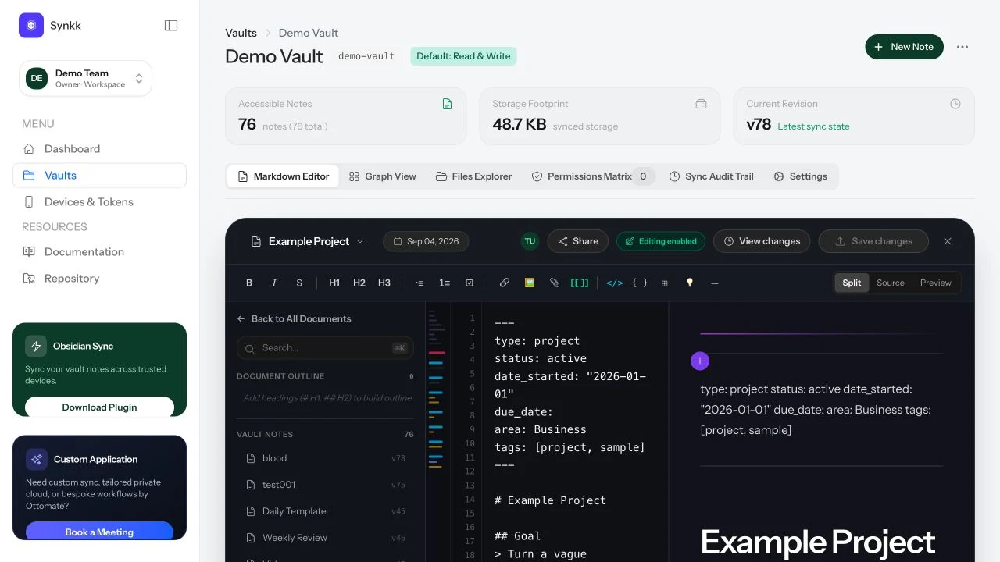
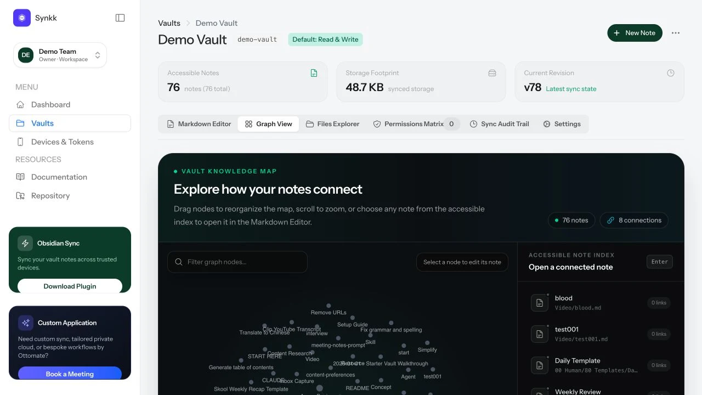
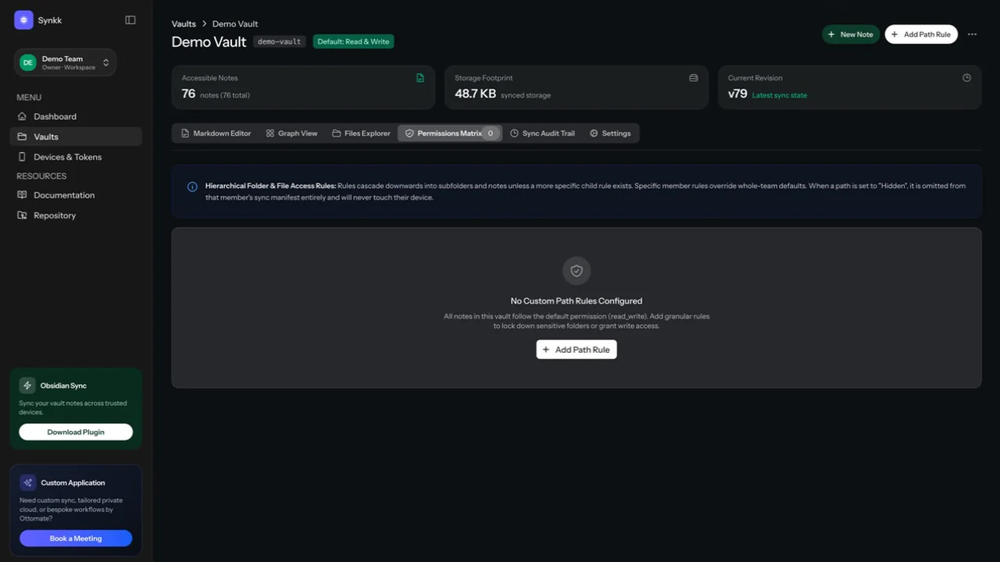

# Synkk

<p align="center">
  
</p>

<p align="center">
  <strong>Self-hosted team vault sync for Obsidian.</strong><br>
  Keep Markdown, permissions, versions, and trusted devices together on infrastructure you control.
</p>

<p align="center">
  <a href="https://synkk.space">Website</a> ·
  <a href="https://synkk.space/docs">Docs</a> ·
  <a href="https://github.com/tawandajosephmutsena/synk-obsidian-plugin/releases/tag/1.0.0">Plugin v1.0.0</a> ·
  <a href="https://github.com/tawandajosephmutsena/synk-obsidian-plugin">Obsidian plugin repo</a> ·
  <a href="https://ottomate.space">Ottomate</a>
</p>


Synkk is the web server and dashboard for a controlled Obsidian sync workflow. The Foundation release is built for people who want a private team vault, path-aware access, reliable whole-file sync, clear version history, and a safer launch path before the advanced sync roadmap lands.

## ⚡ 1-Click Deployment

Deploy your private Synkk team vault sync server instantly:

<p align="left">
  <a href="https://render.com/deploy?repo=https://github.com/tawandajosephmutsena/synkk">
    
  </a>
  <a href="https://railway.app/new/template?template=https://github.com/tawandajosephmutsena/synkk">
    
  </a>
  <a href="https://synkk.space/docs">
    
  </a>
</p>

### 🚀 1-Line Turnkey Installer (Ubuntu, Debian, AlmaLinux, Rocky, Any VPS)

Run this single command on your server to automatically install Docker, provision Let's Encrypt SSL/TLS via Caddy, configure queue workers and WebSockets, and bootstrap your superadmin account in under 3 minutes:

```bash
curl -sSL https://synkk.space/install.sh | bash
```

### 🐳 Run With Docker Compose

```bash
# 1. Download production compose file & Caddy configuration
curl -sSL https://raw.githubusercontent.com/tawandajosephmutsena/synkk/main/docker-compose.prod.yml -o docker-compose.yml
curl -sSL https://raw.githubusercontent.com/tawandajosephmutsena/synkk/main/docker/Caddyfile -o Caddyfile
curl -sSL https://raw.githubusercontent.com/tawandajosephmutsena/synkk/main/.env.production.example -o .env

# 2. Launch production container stack with automated HTTPS
docker compose up -d
```

## Product Screens

| Dashboard | Markdown Editor |
| --- | --- |
|  |  |

| Graph View | Permissions Matrix |
| --- | --- |
|  |  |

## What Ships Now

- Laravel server for team membership, vault ownership, device tokens, and scoped vault access.
- Whole-file sync API with SHA-256 verification, file versions, conflict copies, audit logs, and soft-delete tombstones.
- Obsidian plugin v1.0.0 with startup, scheduled, and manual sync.
- Device-level include/exclude rules for selective folder sync.
- Granular `.obsidian` controls for plugin list, snippets, and plugin data while keeping layout, hotkeys, cache, and Synkk state local.
- Atomic Safety Shield with deletion thresholds, one-time override, and local snapshots before remote overwrite/delete operations.
- Web dashboard, Markdown editor, Graph View, permissions matrix, version restore, and public docs.

## Launch Links

- Public app: [synkk.space](https://synkk.space)
- Documentation: [synkk.space/docs](https://synkk.space/docs)
- Web/server repo: [github.com/tawandajosephmutsena/synkk](https://github.com/tawandajosephmutsena/synkk)
- Obsidian plugin repo: [github.com/tawandajosephmutsena/synk-obsidian-plugin](https://github.com/tawandajosephmutsena/synk-obsidian-plugin)
- Plugin release: [v1.0.0](https://github.com/tawandajosephmutsena/synk-obsidian-plugin/releases/tag/1.0.0)
- Creator studio: [Ottomate](https://ottomate.space)
- Commercial license: Lemon Squeezy checkout is enabled only after the live product, checkout, and activation flow are verified end to end.
- AppSumo: planned after the GitHub public release and production checkout are stable.

## Current Limits

Synkk Foundation is not a CRDT engine yet. It does not currently ship character-level merge, peer-to-peer transport, QR pairing, zero-knowledge client-side encryption, content-defined delta attachment sync, virtual/ghost files, native mobile background sync, or an official Obsidian Community Plugins listing.

Those features belong on the public roadmap so users can see the direction without confusing planned work for shipped behavior.

## Install The Plugin

Build the plugin from `obsidian-plugin/`:

```bash
cd obsidian-plugin
npm ci
npm run build
```

Install `main.js`, `manifest.json`, and `styles.css` in `<vault>/.obsidian/plugins/synkk-sync/`, then configure an HTTPS Synkk API endpoint ending in `/api/v1` and a device token from the dashboard.

## Run The Server Locally

```bash
composer setup
composer run dev
```

For production, provide a unique `APP_KEY`, set `APP_ENV=production`, turn `APP_DEBUG=false`, run migrations, configure durable storage and database backups, serve HTTPS, and keep the required workers running. Never commit a populated `.env` file.

## Roadmap

- **Foundation live:** GitHub plugin release, self-hosted Laravel server, dashboard, Markdown editor, Graph View, path permissions, version restore, selective sync rules, `.obsidian` controls, deletion safety, and snapshots.
- **Launch hardening:** clean self-host install package, verified Lemon Squeezy checkout, license activation UI, AppSumo-ready onboarding, and public release notes.
- **Next:** QR pairing, stronger encrypted transport design, CRDT collaboration, visual conflict sandbox, virtual files, and smarter attachment sync.
- **Later:** peer-assisted relay transport, native mobile background sync, and advanced team/folder federation.

## Creators

Synkk is created by [Ottomate](https://ottomate.space). Product direction and engineering are led by [Tawanda Joseph Mutsena](https://github.com/tawandajosephmutsena).

## Security

Do not include credentials, device tokens, or vault content in public issues. Until a dedicated security reporting address is published, report suspected vulnerabilities privately through GitHub's private reporting channel when available.

## License

Synkk is released under the [MIT License](LICENSE).
