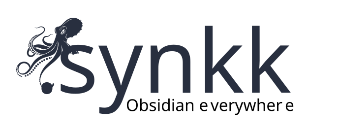
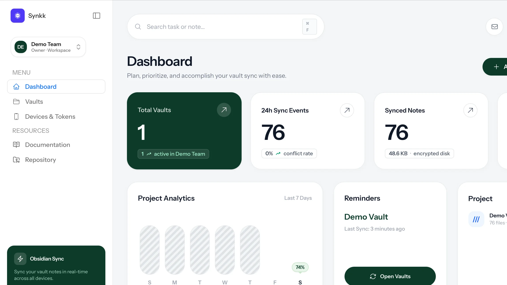
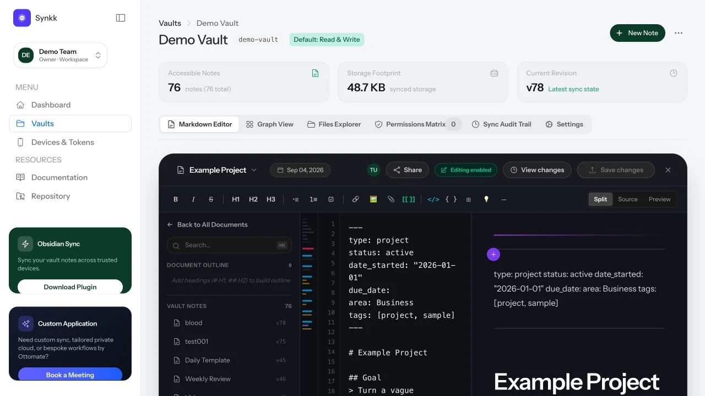
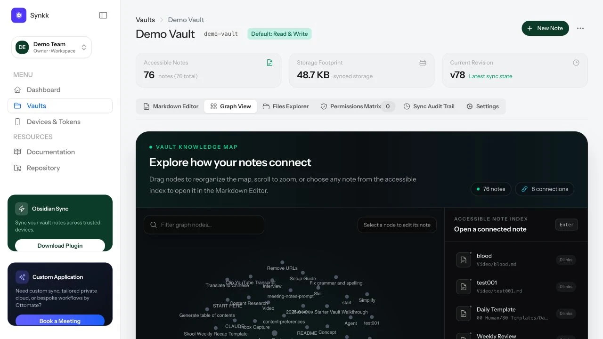
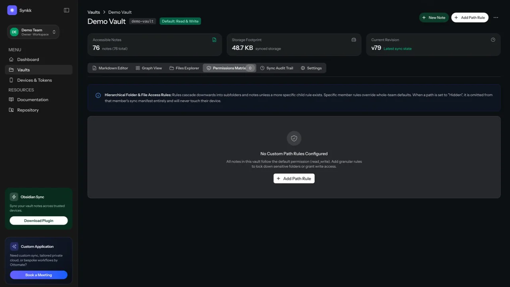

# Synkk

<p align="center">
  
</p>

<p align="center">
  <strong>Self-hosted team vault sync for Obsidian.</strong><br>
  Keep Markdown, permissions, versions, and trusted devices together on infrastructure you control.
</p>

<p align="center">
  <a href="https://synkk.space">Website</a> ·
  <a href="https://synkk.space/documentation">Docs</a> ·
  <a href="https://github.com/tawandajosephmutsena/synk-obsidian-plugin/releases/latest">Plugin latest release</a> ·
  <a href="https://github.com/tawandajosephmutsena/synk-obsidian-plugin">Obsidian plugin repo</a> ·
  <a href="https://ottomate.space">Ottomate</a>
</p>



Synkk is the web server and dashboard for a controlled Obsidian sync workflow. The Foundation release is built for people who want a private team vault, path-aware access, reliable whole-file sync, clear version history, and a safer launch path before the advanced sync roadmap lands.

## Install Synkk

### 🚀 VPS Installer (Ubuntu, Debian, AlmaLinux, Rocky)

Point a public DNS name at your server and allow inbound ports 80 and 443. From a Synkk source checkout, run the installer as root. It prompts for an administrator password or generates one, installs Docker if needed, and starts Synkk behind Caddy HTTPS:

```bash
git clone --recurse-submodules https://github.com/tawandajosephmutsena/synkk.git
cd synkk
sudo SYNKK_DOMAIN=vault.example.com SYNKK_ADMIN_EMAIL=you@example.com bash install.sh
```

Replace the example domain and email. Keep the generated login credentials and `/opt/synkk/.env.production` private. Installation requires a working DNS record and valid TLS certificate; build time depends on your server and network. Configure SMTP after installation to deliver invitations and password recovery emails.

### 🐳 Run With Docker Compose

```bash
# 1. Clone the repository and prepare the environment
git clone --recurse-submodules https://github.com/tawandajosephmutsena/synkk.git
cd synkk
cp .env.production.example .env.production

# 2. Generate a stable APP_KEY and unique Reverb credentials
openssl rand -base64 32
openssl rand -hex 16
openssl rand -hex 32

# 3. Edit .env.production as described below, then start Synkk
docker compose -f docker-compose.prod.yml up -d --build
docker compose -f docker-compose.prod.yml ps
```

In `.env.production`, set `APP_KEY=base64:<output of the first command>`, put the two hex values in `REVERB_APP_KEY` and `REVERB_APP_SECRET`, and set `APP_URL` to your public HTTPS address. Keep `REVERB_HOST=127.0.0.1`, `REVERB_PORT=8080`, and `REVERB_SCHEME=http` for server-side publishing inside the container. Uncomment `SYNKK_BOOTSTRAP_EMAIL` and `SYNKK_BOOTSTRAP_PASSWORD` and replace their examples with your own credentials **before first start**. The container creates that owner account once; sign in at `APP_URL` with those credentials. The database and uploaded files use named Docker volumes and survive container replacement.

This Compose file serves HTTP on host loopback port 8000. Put a trusted HTTPS reverse proxy in front of it, forwarding WebSocket upgrades to the same port, before exposing Synkk publicly. For a localhost-only trial, set `APP_URL=http://localhost:8000` and `SESSION_SECURE_COOKIE=false` in `.env.production`. Configure SMTP before using invitations, password recovery, or email changes; the default log mailer cannot deliver email. After the first login, remove the bootstrap credentials from `.env.production` and recreate the container with `docker compose -f docker-compose.prod.yml up -d`.

## Product Screens

| Dashboard | Markdown Editor |
| --- | --- |
|  |  |

| Graph View | Permissions Matrix |
| --- | --- |
|  |  |

## What Ships Now

- **Instant 3-Second QR Mobile Pairing:** Pair any iOS or Android device in seconds using camera scanning or `obsidian://synkk-pair` deep link protocols without manual key entry.
- **Interactive Livewire Vault Portals:** Publish any team vault as a live, interactive web portal at `/p/{slug}` in real time without static site builders or node scripts. Includes 4 design presets (Obsidian Clean, Enterprise Documentation, Digital Garden, Minimalist Blog), instant Livewire fuzzy search, interactive backlinks, and dark mode. [Explore the live Synkk Docs Portal](https://synkk.space/p/synkk-docs).
- **First-Sync Pre-Flight & Migration Engine:** Deterministic 4-phase local diagnostic scan (category rollup across Markdown, Canvases, Images, Media, PDFs), friction trap detection, 1-click cross-platform path sanitizer, dry-run simulation API (`POST /api/v1/vaults/{slug}/preflight`), and Atomic Safety Shield (20% deletion circuit breaker).
- **Laravel Backend Server:** High-performance local-first sync server with SQLite WAL, team tenancy, device tokens, and scoped vault access.
- **Whole-File Sync & Conflict Engine:** SHA-256 manifest verification, immutable file versions, conflict copies (`.sync-conflict-[timestamp].md`), audit logs, and soft-delete tombstones.
- **Obsidian Plugin v1.0.0:** Native desktop and mobile plugin with startup, scheduled, and manual sync pulses.
- **Device-Level Selective Sync:** Granular include/exclude glob patterns and path-based team access controls (Admin, Editor, Reader, Hidden).
- **In-App DLP Secret Scanning:** Intercepts accidental commits of AWS, OpenAI, Anthropic, SSH keys, or JWT tokens before storage.
- **Granular `.obsidian` Controls:** Synchronizes plugin lists, snippets, and plugin data while preserving local workspace layout and hotkeys.
- **Enterprise Remote Device Wipe:** 1-click revocation and remote token invalidation (HTTP 410 auto-purge).
- **Web Workspace & Visual Graph:** In-browser Markdown editor with split preview and 2D physics-based force graph canvas.

## Launch Links

- Public app: [synkk.space](https://synkk.space)
- Live Docs Portal: [synkk.space/p/synkk-docs](https://synkk.space/p/synkk-docs)
- Documentation: [synkk.space/documentation](https://synkk.space/documentation)
- Web/server repo: [github.com/tawandajosephmutsena/synkk](https://github.com/tawandajosephmutsena/synkk)
- Obsidian plugin repo: [github.com/tawandajosephmutsena/synk-obsidian-plugin](https://github.com/tawandajosephmutsena/synk-obsidian-plugin)
- Plugin release: [Latest release](https://github.com/tawandajosephmutsena/synk-obsidian-plugin/releases/latest)
- Creator studio: [Ottomate](https://ottomate.space)
- Commercial license: Lemon Squeezy checkout is enabled only after the live product, checkout, and activation flow are verified end to end.
- AppSumo: planned after the GitHub public release and production checkout are stable.

## Current Architecture & Capabilities

Synkk ships reliable whole-file sync, pre-flight migration safety, instant QR pairing, livewire vault portals, real-time CodeMirror 6 CRDT collaboration, client-side AES-256-GCM E2EE, and on-demand mobile ghost files. Next milestones on our active development horizon:

- **Webhooks & Automated Relays:** Event-driven HTTP relays triggered on note lifecycle changes and sync completions.
- **Federated Multi-Server Mesh:** Inter-cluster vault synchronization between self-hosted team servers.
- **Vault Copilot & Local RAG:** Private Ollama/vLLM vector embeddings and neural graph querying.
- **Enterprise SIEM Streaming:** Immutable structured audit log export to Datadog, Splunk, or OpenTelemetry.

## Install The Plugin

Build the plugin from `obsidian-plugin/`:

```bash
cd obsidian-plugin
npm ci
npm run check
```

Install `main.js`, `manifest.json`, and `styles.css` in `<vault>/.obsidian/plugins/synkk-sync/`, or install directly from Obsidian's official Community Plugins directory (`obsidian://show-plugin?id=synkk-sync`). Then configure an HTTPS Synkk API endpoint ending in `/api/v1` and a device token from the dashboard (or scan the Instant QR Code).

## Run The Server Locally

```bash
composer setup
composer run dev
```

For production, provide a unique `APP_KEY`, set `APP_ENV=production`, turn `APP_DEBUG=false`, run migrations, configure durable storage and database backups, serve HTTPS, and keep the required workers running. Never commit a populated `.env` file.

## Roadmap

- **Foundation live:** Obsidian Community Plugin directory listing, self-hosted Laravel server, dashboard, Markdown editor, Graph View, path permissions, version restore, selective sync rules, `.obsidian` controls, deletion safety, and snapshots.
- **Milestone A (Shipped):** Instant 2-Second QR Mobile Pairing and deep linking protocol (`obsidian://synkk-pair`).
- **Milestone B (Shipped):** Interactive Livewire Vault Portals at `/p/{slug}` with 4 themes, live search, and wikilink navigation.
- **Milestone C (Shipped):** First-Sync Pre-Flight & Migration Engine, 4-phase local diagnostic rollup, 1-click path sanitizer, dry-run simulation API, and 20% mass deletion atomic safety shield.
- **Milestone D (Shipped):** Full CodeMirror 6 Web CRDT Collaborative Editor with Livewire session convergence and real-time remote awareness carets.
- **Milestone E (Shipped):** Zero-Knowledge Client-Side E2EE with WebCrypto AES-256-GCM authenticated envelopes and on-demand Mobile Ghost Files.
- **Active Horizon:** Webhooks & automated HTTP relays, federated multi-server synchronization, and private local RAG indexing.

## Creators

Synkk is created by [Ottomate](https://ottomate.space). Product direction and engineering are led by [Tawanda Joseph Mutsena](https://github.com/tawandajosephmutsena).

## Security

Do not include credentials, device tokens, or vault content in public issues. Until a dedicated security reporting address is published, report suspected vulnerabilities privately through GitHub's private reporting channel when available.

## License

Synkk is released under the [MIT License](LICENSE).
